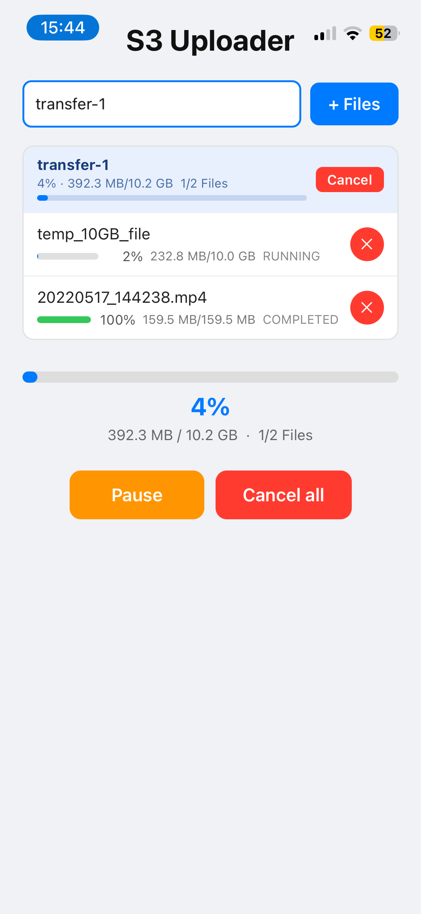
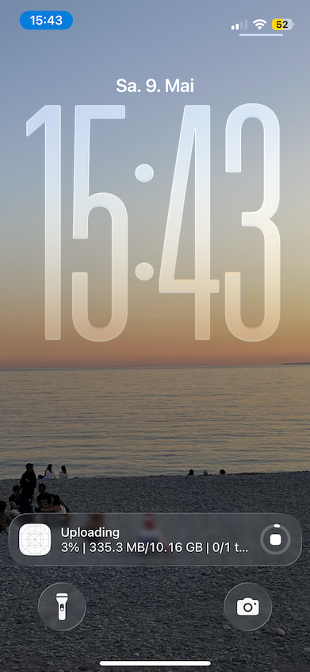

# react-native-s3-bg-uploader

[](https://www.npmjs.com/package/react-native-s3-bg-uploader)
[](https://www.npmjs.com/package/react-native-s3-bg-uploader)
[](https://github.com/nikwebr/react-native-s3-bg-uploader/LICENSE)

<strong>📖 [Read the Documentation](https://uploader.ysendit.com/docs)</strong>

Seamless file uploads that continue even when your app goes to background. Pausable, resumable, and built for the S3 API. 
react-native-s3-bg-uploader is a react native package built with Nitro and Rust. It is compiled to native modules on iOS and Android, and to WebAssembly for the web. On iOS it uses a BGContinuedProcessingTask and on Android a foreground service.

<p float="left">
  
  
</p>


## Requirements

- React Native v0.76.0 or higher
- Node 18.0.0 or higher

### iOS
- background uploading is only supported for iOS 26 or later
- enabled "background fetch" & "background processing" capabilities
- registered BGTaskSchedulerPermittedIdentifiers of value $(PRODUCT_BUNDLE_IDENTIFIER).background inside info.plist

## Installation

```bash
npm install react-native-s3-bg-uploader react-native-nitro-modules
```

## Usage

```ts
import { S3BgUploader } from 'react-native-s3-bg-uploader'

// Configure backend endpoints once (e.g. in app startup)
S3BgUploader.setConfig(
  'https://api.example.com/upload/startUpload',
  'https://api.example.com/upload/getUploadUrls',
  'https://api.example.com/upload/completeUpload',
)

// Track progress
S3BgUploader.setProgressCallback((file, session, transfer) => {
  console.log(`${transfer.percentage}% — ${file.fileName}`)
})

// Enqueue files and start
const transferId = 'my-transfer'
await S3BgUploader.uploadFile('/path/to/file.mp4', transferId, { userId: '42' })
await S3BgUploader.resume()

// Pause / resume / cancel
S3BgUploader.pause()
await S3BgUploader.resume()
S3BgUploader.cancel()
```

For the full API reference see the [documentation](https://uploader.ysendit.com/docs).

## Building
For native platforms:
```bash
npm run build:ios
npm run build:android
```

For web:
```bash
npm run build:wasm
```

### Additional requirements
- [rustup](https://rust-lang.org/tools/install/)
- **iOS**: Xcode with Command Line Tools (`xcode-select --install`)
- **Android**: Android SDK with NDK — set `ANDROID_NDK_HOME` or `ANDROID_NDK_ROOT`, install [cargo-ndk](https://github.com/bbqsrc/cargo-ndk) (`cargo install cargo-ndk`)

### Running the Example App
```bash
npm install
npm run example:ios
npm run example:android
npm run example:web
```

> [!IMPORTANT]  
> Background uploads on iOS only work on a physical device as the simulator does not support the BGContinuedProcessingTask API.

> [!IMPORTANT]  
> Please do not upload confidential files. The example app is connected to a demo s3 bucket. Files are only deleted irregularly from this bucket.

### Production Builds
#### Android
Follow the instructions [here](https://reactnative.dev/docs/signed-apk-android#generating-an-upload-key) to generate an upload key and to set required gradle variables.

After that:
```bash
cd example
npx react-native build-android --mode=release
npm run android -- --mode="release"
```

#### iOS
Change build configuration to production inside XCode: Open S3BackgroundUploaderExample.xcworkspace and edit the scheme.

## Troubleshooting
### ReferenceError: Can't find variable: wasm_bindgen
Run in the root of the repo
```bash
npm run build:rust:wasm
```

## Credits

Bootstrapped with [create-nitro-module](https://github.com/patrickkabwe/create-nitro-module).

## Contributing

Pull requests are welcome. For major changes, please open an issue first to discuss what you would like to change.
